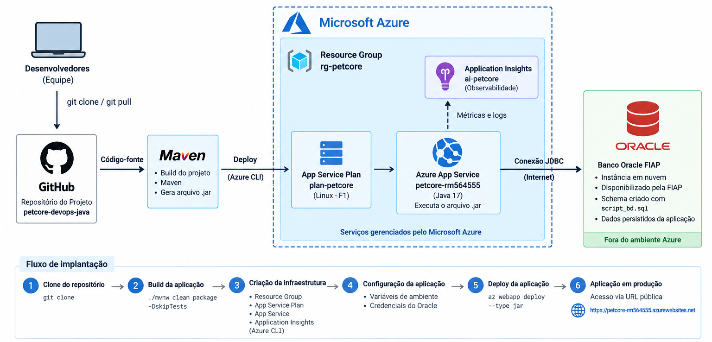

# PetCore

## 1. Descrição da solução

O **PetCore** é uma aplicação web desenvolvida em **Java com Spring
Boot** para gerenciamento de informações relacionadas aos cuidados de
animais de estimação.

Para a Sprint 3 de **DevOps Tools & Cloud Computing**, a aplicação foi
preparada para execução em nuvem utilizando **Microsoft Azure App
Service**, com persistência no **Banco Oracle da FIAP**.

A aplicação é implantada no Azure como arquivo executável `.jar`, **sem
containers**, seguindo a opção arquitetural **Azure App Service + Banco
de Dados em Nuvem**.

## 2. Benefícios da solução

-   Aplicação disponível em nuvem por URL pública.
-   Persistência em banco Oracle remoto.
-   Separação entre aplicação e banco.
-   Credenciais configuradas por variáveis de ambiente.
-   Implantação reproduzível por Azure CLI.
-   Serviço gerenciado de aplicação.
-   Componente de observabilidade com Azure Application Insights.

## 3. Tecnologias utilizadas

**Aplicação:** Java 17, Spring Boot, Spring MVC, Spring Data JPA, Spring
Security, Thymeleaf e Maven.

**Banco:** Oracle Database - Banco Oracle FIAP, Oracle JDBC Driver e
SQL/DDL.

**Cloud e DevOps:** Microsoft Azure, Azure App Service, Azure App
Service Plan, Azure Application Insights, Azure CLI, Git e GitHub.

## 4. Arquitetura da solução



### Funcionamento da arquitetura
O código-fonte do PetCore é versionado no GitHub. A partir do repositório, o projeto é clonado e compilado com Maven, gerando o arquivo executável `.jar`.

A infraestrutura da aplicação é provisionada por meio da Azure CLI. No Microsoft Azure, a solução utiliza um Resource Group (`rg-petcore`), um App Service Plan Linux F1 (`plan-petcore`) e um Azure App Service (`petcore-rm564555`) com runtime Java 17. O deploy do arquivo `.jar` também é realizado por Azure CLI.

As configurações de conexão com o banco são armazenadas como variáveis de ambiente no Azure App Service, evitando a exposição de credenciais no código-fonte ou no GitHub.

A aplicação hospedada no Azure se comunica por JDBC com o Banco Oracle da FIAP, utilizado como Banco de Dados em Nuvem. A estrutura do schema é criada pelo arquivo `script_bd.sql`, que contém o DDL das tabelas, relacionamentos, constraints e dados iniciais.

O Azure Application Insights (`ai-petcore`) compõe a camada de observabilidade da arquitetura. Após o deploy, o PetCore é disponibilizado por uma URL pública do Azure App Service.

## 5. Banco de Dados em Nuvem

Foi utilizado o **Banco Oracle da FIAP**. A instância Oracle
é disponibilizada pela FIAP e o schema da aplicação é preparado pelo
arquivo `script_bd.sql`.

O `script_bd.sql` contém criação das tabelas e colunas, chaves primárias
e estrangeiras, constraints, relacionamentos, comentários e dados
iniciais.

### Preparação do Oracle FIAP

Conecte-se ao Oracle FIAP com as credenciais acadêmicas e execute
`script_bd.sql`, disponível na raiz do repositório.

Validação:

``` sql
SELECT COUNT(*) FROM tutor_petcore;
SELECT COUNT(*) FROM pet_petcore;
```

Carga inicial esperada: `tutor_petcore` = 5 registros e `pet_petcore` =
9 registros.

## 6. Configuração da aplicação

O arquivo `src/main/resources/application.properties` utiliza variáveis
de ambiente:

``` properties
spring.datasource.url=${SPRING_DATASOURCE_URL}
spring.datasource.username=${SPRING_DATASOURCE_USERNAME}
spring.datasource.password=${SPRING_DATASOURCE_PASSWORD}
spring.datasource.driver-class-name=oracle.jdbc.OracleDriver
spring.jpa.database-platform=org.hibernate.dialect.OracleDialect
spring.jpa.hibernate.ddl-auto=none
spring.flyway.enabled=false
server.forward-headers-strategy=framework
```

## 7. Deploy no Microsoft Azure

### 7.1 Pré-requisitos

Acesso à assinatura Azure, Azure CLI ou Azure Cloud Shell, Git, acesso
ao Banco Oracle FIAP e ao repositório GitHub.

### 7.2 Clonar o projeto

``` bash
git clone https://github.com/juliakina/petcore-devops-java.git
cd petcore-devops-java
```

### 7.3 Scripts de infraestrutura

Os scripts entregues na pasta `scripts/` são:

``` text
01-resource-group.sh
02-app-service-plan.sh
03-webapp.sh
04-app-settings.sh
05-application-insights.sh
06-deploy.sh
```

Recursos utilizados:

``` bash
RESOURCE_GROUP_NAME="rg-petcore"
WEBAPP_NAME="petcore-rm564555"
APP_SERVICE_PLAN="plan-petcore"
LOCATION="brazilsouth"
RUNTIME="JAVA:17-java17"
APP_INSIGHTS_NAME="ai-petcore"
```

### 7.4 Resource Group

``` bash
bash scripts/01-resource-group.sh
```

### 7.5 App Service Plan

``` bash
bash scripts/02-app-service-plan.sh
```

É utilizado App Service Plan Linux na camada **Free F1**.

### 7.6 Azure App Service

``` bash
bash scripts/03-webapp.sh
```

O Web App utiliza Java 17 e não utiliza container.

### 7.7 Conexão com Oracle

``` bash
bash scripts/04-app-settings.sh
```

O script solicita a senha sem armazená-la no arquivo e configura
`SPRING_DATASOURCE_URL`, `SPRING_DATASOURCE_USERNAME` e
`SPRING_DATASOURCE_PASSWORD`.

URL JDBC:

``` text
jdbc:oracle:thin:@//oracle.fiap.com.br:1521/ORCL
```

**Nenhuma senha deve ser adicionada ao GitHub.**

### 7.8 Application Insights

``` bash
bash scripts/05-application-insights.sh
```

O script registra os providers necessários e cria `ai-petcore` como
componente de observabilidade.

### 7.9 Build e deploy

``` bash
bash scripts/06-deploy.sh
```

O build executa:

``` bash
chmod +x mvnw
./mvnw clean package -DskipTests
```

Artefato:

``` text
target/challenge_petcore-0.0.1-SNAPSHOT.jar
```

O deploy é realizado com `az webapp deploy --type jar`.

## 8. URL da aplicação

``` text
https://petcore-rm564555.azurewebsites.net
```

## 9. Validação da persistência no Oracle

Após cada operação na aplicação hospedada no Azure, a persistência deve
ser comprovada no Oracle.

``` sql
SELECT * FROM tutor_petcore;
SELECT * FROM pet_petcore;
```

Fluxo:

``` text
INSERT pela aplicação -> SELECT no Oracle
UPDATE pela aplicação -> SELECT no Oracle
DELETE pela aplicação -> SELECT no Oracle
CONSULTA pela aplicação -> SELECT no Oracle
```

## 10. Segurança

As credenciais não são armazenadas no código-fonte nem no GitHub. São
utilizadas as variáveis:

``` text
SPRING_DATASOURCE_URL
SPRING_DATASOURCE_USERNAME
SPRING_DATASOURCE_PASSWORD
```

O script `04-app-settings.sh` solicita a senha de forma interativa.

## 11. Observabilidade

Foi criado por Azure CLI o recurso **Azure Application Insights**
`ai-petcore` como componente de observabilidade da arquitetura.

## 12. Estrutura principal

``` text
petcore-devops-java/
├── scripts/
│   ├── 01-resource-group.sh
│   ├── 02-app-service-plan.sh
│   ├── 03-webapp.sh
│   ├── 04-app-settings.sh
│   ├── 05-application-insights.sh
│   └── 06-deploy.sh
├── docs/
│   └── diagrama.png
├── src/
├── script_bd.sql
├── pom.xml
├── mvnw
├── mvnw.cmd
└── README.md
```

## 13. Integrantes
Carolina Nascimento Gonçalves
- RM: 564786
- 2TDSPJ
- [Github](https://github.com/carolnascgoncalves)
- [Linkedin](http://linkedin.com/in/carolina-nascimento-906274364)

Emanuelly Ventura do Nascimento
- RM: 562339
- 2TDSPJ
- [Github](https://github.com/Emanuelly0ventura)
- [Linkedin](https://www.linkedin.com/in/emanuelly-ventura-966135355)

Julia Sayuri Kina
- RM: 564555
- 2TDSPJ
- [Github](https://github.com/juliakina)
- [Linkedin](https://www.linkedin.com/in/julia-kina)

## 14. Demonstração 
Confira a demonstração completa no YouTube!  
➔ [Clique aqui para assistir!](https://youtu.be/4iLHNugO3lQ)

